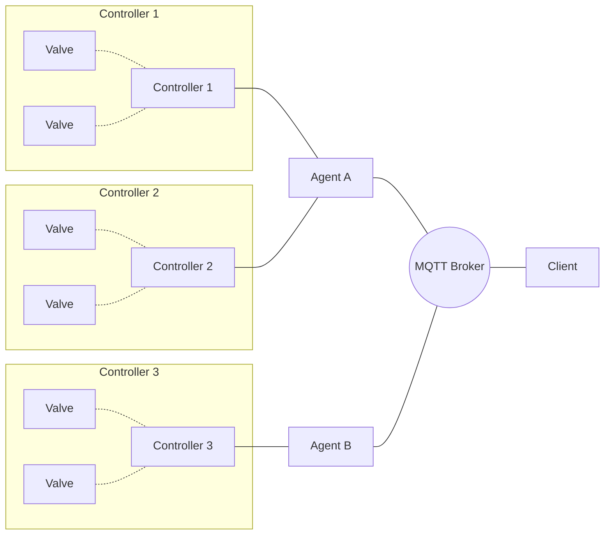

# Architecture

The opendrip system architecture is primarily an MQTT-backed message passing architecture with 3 types of actors:
- Controller
- Agent
- Client

Controllers are units that control physical devices in the irrigation system (valves, flow meters, moisture sensors, etc). Controllers do not directly send or receive MQTT messages.

Agents are units that communicate with Controllers and handle sending/receiving MQTT messages relevant to that Controller. An Agent can communicate with multiple Controllers. A single device can also act as both an Agent and Controller to send/receive its own messages.

Clients are interfaces for viewing and interacting with the system. Clients view the live state of the system via MQTT subscriptions and interact with the system by publishing MQTT messages.

An example architecture diagram is shown below.

